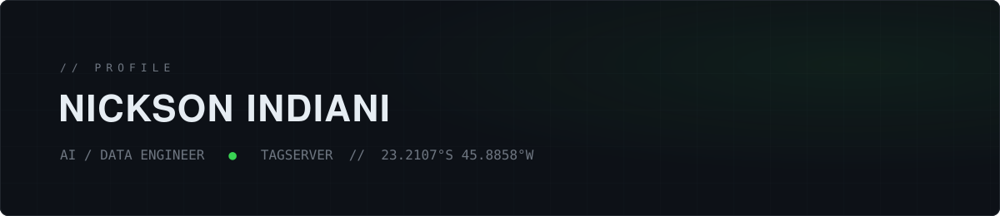

I build the data & AI layer of a MarTech SaaS — a semantic engine that powers analytics dashboards, multi-agent LLM systems that automate business workflows, and pipelines that turn raw ad-platform data into decisions.

Previously: co-founded product as CTO, doubled campaign ROI as a marketing data analyst. Computer Engineering @ UNIVESP.

## Systems I've built

**Server-side tracking platform** — `rust` `axum` `postgresql`
> Production SaaS ingesting, enriching and forwarding conversion events to Meta CAPI, Google Ads Enhanced Conversions and GA4 — multi-tenant, feature-flagged, built to replace client-side tracking entirely.

**First-party tag SDK** — `javascript` `browser`
> A lightweight in-house replacement for Google Tag Manager: instrumentation rules and data extractors fetched from the platform API, deployed as a single standalone script on client sites.

**Semantic analytics engine** — `typescript` `duckdb`
> A query-compilation layer between the warehouse and React dashboards: every metric, filter and aggregation flows through one governed engine — no ad-hoc SQL in the frontend, ever.

**Multi-agent AI operations system** — `llm orchestration` `postgresql`
> LLM agents with persistent memory over a dedicated database cluster — they read the company's codebases, explain systems on demand and automate business workflows end-to-end.

**Multi-tenant marketing data pipeline** — `python` `fastapi`
> Collectors for Meta, Google Ads, GA4 and RD Station APIs feeding Postgres and automated reporting — the data backbone behind campaign decisions for every client.

**Operiva** — `rust` `ddd`
> An independent SaaS product in the making, built on hexagonal architecture: isolated domain/application/api crates, typed value objects, sqlx migrations, CI from day one.

These systems run in production or active development in private codebases — happy to walk through the architecture.

## What I work with

<samp>LANGUAGES & CORE</samp>

`python` `sql` `rust` `typescript` `postgresql` `duckdb` `fastapi` `react`

<samp>DATA PLATFORM</samp>

`airflow` `dbt` `bigquery` `spark` `kafka` `terraform` `databricks`

<samp>MARTECH</samp>

`meta capi` `google ads api` `ga4` `sgtm` `server-side tracking`

<samp>AI SYSTEMS</samp>

`llm multi-agent orchestration` `rag · pgvector` `eval pipelines` `fine-tuning`

---

<samp>reach me</samp> — [LinkedIn](https://www.linkedin.com/in/nickson-indiani/) · [data.nicksonindiani@gmail.com](mailto:data.nicksonindiani@gmail.com)
